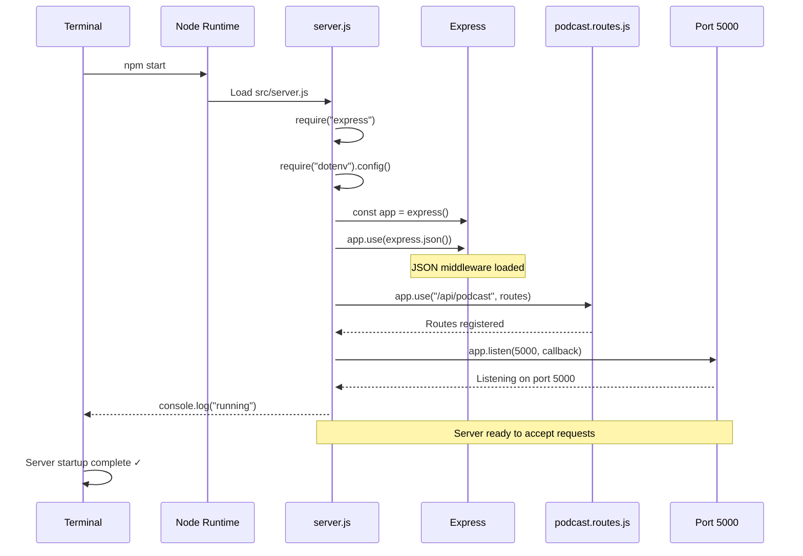
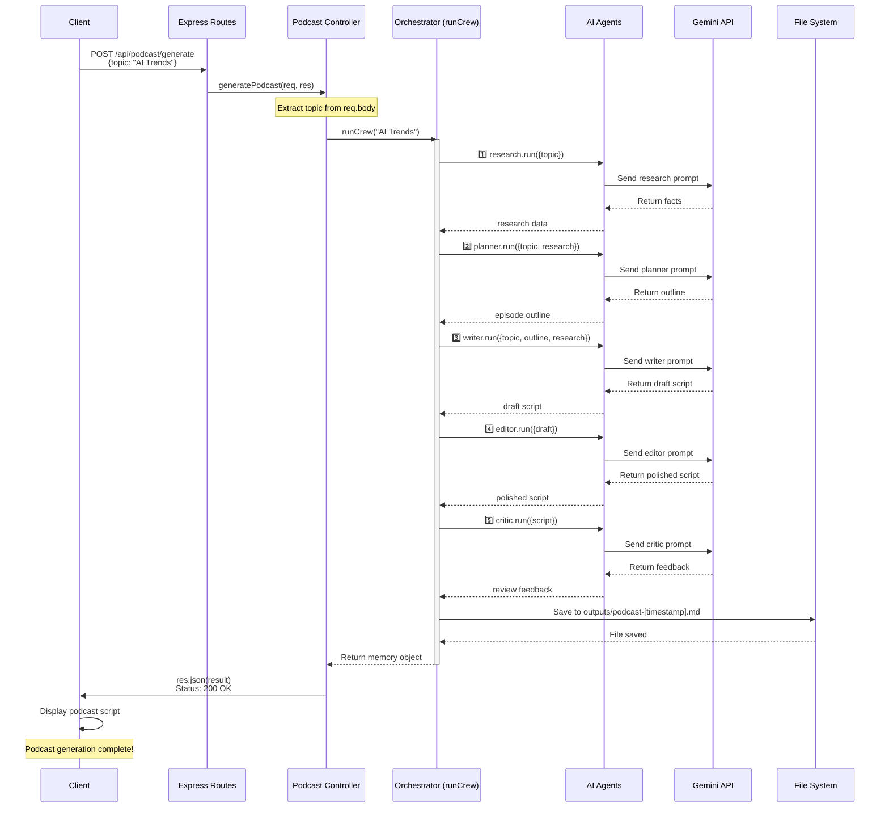
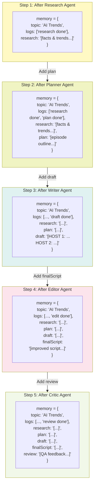
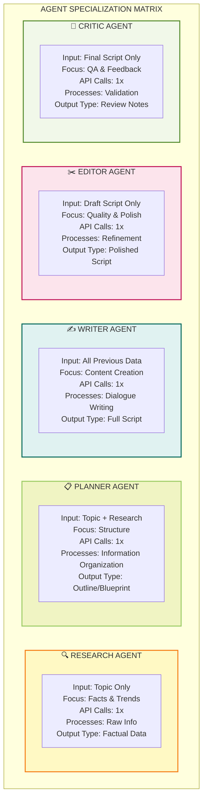
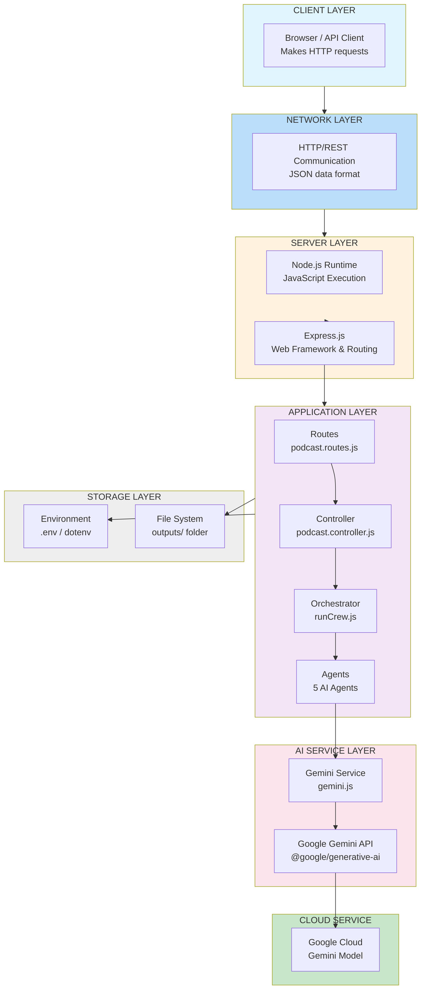
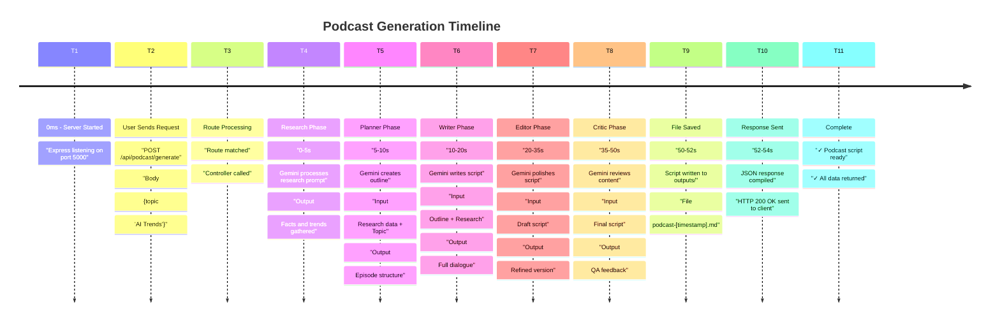
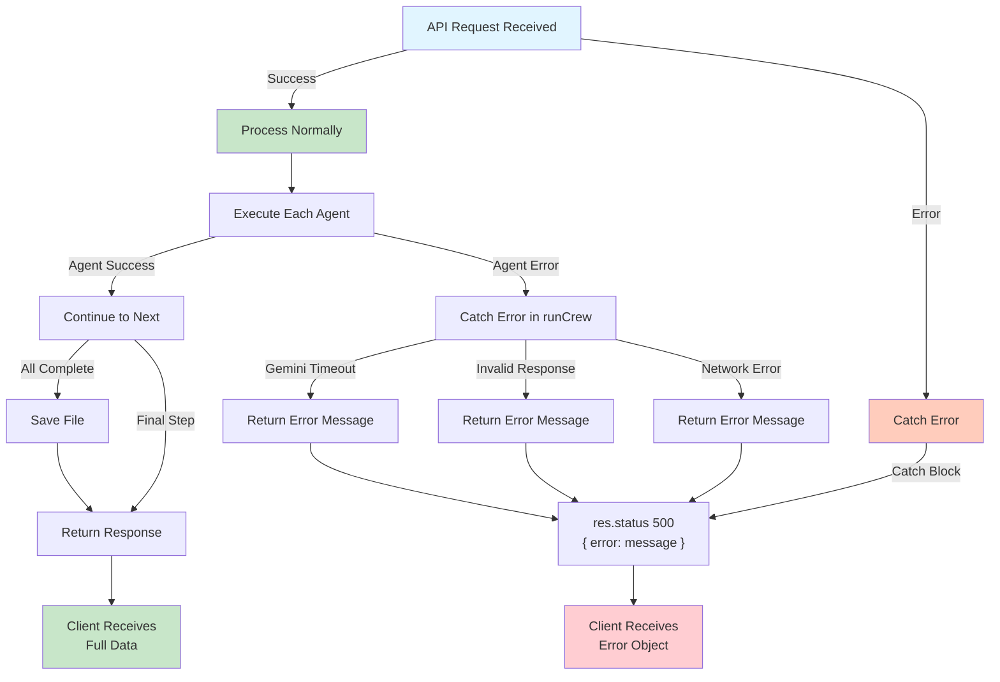

# Agentic Podcast System - Visual Flowcharts & Diagrams

## 1. Complete System Architecture Flowchart

```mermaid
graph TD
    A["🖥️ CLIENT REQUEST<br/>POST /api/podcast/generate<br/>Body: {topic: 'AI Trends'}"] -->|HTTP| B["📦 EXPRESS SERVER<br/>src/server.js<br/>Port: 5000"]

    B -->|Route Match| C["🛣️ ROUTES<br/>src/routes/podcast.routes.js<br/>Matches /api/podcast/generate"]

    C -->|Call Handler| D["⚙️ CONTROLLER<br/>src/controllers/podcast.controller.js<br/>generatePodcast()"]

    D -->|Execute| E["🎭 ORCHESTRATOR<br/>src/orchestrator/runCrew.js<br/>Coordinates 5 agents<br/>Manages memory object"]

    E -->|1️⃣ Research| F["🔍 RESEARCH AGENT<br/>Analyzes topic<br/>Gathers facts & trends<br/>Creates knowledge base"]

    F -->|Output + Topic| G["📋 PLANNER AGENT<br/>Creates episode outline<br/>Plans structure & flow<br/>Designs segments"]

    G -->|Output + All Previous| H["✍️ WRITER AGENT<br/>Writes host dialogue<br/>Creates full script<br/>Adds conversational tone"]

    H -->|Output| I["✂️ EDITOR AGENT<br/>Improves script quality<br/>Fixes grammar & flow<br/>Polishes content"]

    I -->|Output| J["🎯 CRITIC AGENT<br/>Reviews for weaknesses<br/>Provides QA feedback<br/>Final quality check"]

    J -->|Final Output| K["💾 FILE SYSTEM<br/>Saves to outputs/<br/>podcast-[timestamp].md"]

    K -->|Return| L["📤 JSON RESPONSE<br/>topic, file, logs,<br/>research, outline,<br/>review, script"]

    L -->|HTTP 200| M["👤 CLIENT<br/>Receives podcast script<br/>Ready to publish"]

    style A fill:#e1f5ff
    style B fill:#fff3e0
    style C fill:#fff3e0
    style D fill:#f3e5f5
    style E fill:#e8f5e9
    style F fill:#fff9c4
    style G fill:#f0f4c3
    style H fill:#e0f2f1
    style I fill:#fce4ec
    style J fill:#f1f8e9
    style K fill:#eeeeee
    style L fill:#ffccbc
    style M fill:#c8e6c9
```



---

## 2. Agent Specialization & Data Flow

```mermaid
graph LR
    INPUT["📥 INPUT<br/>topic:<br/>AI Trends"]

    subgraph RESEARCH ["Research Agent 🔍"]
        R["Prompt:<br/>Return facts and trends<br/><br/>Role: Research Specialist"]
        R1["Output:<br/>- Latest breakthroughs<br/>- Market trends<br/>- Industry players<br/>- Regulations<br/>- Security concerns"]
    end

    subgraph PLANNER ["Planner Agent 📋"]
        P["Prompt:<br/>Create outline<br/>+ research data<br/><br/>Role: Planner Specialist"]
        P1["Output:<br/>- Opening hook<br/>- Intro section<br/>- Key points (3-5)<br/>- Discussion<br/>- CTA & closing"]
    end

    subgraph WRITER ["Writer Agent ✍️"]
        W["Prompt:<br/>Write two host script<br/>+ outline + research<br/><br/>Role: Writer Specialist"]
        W1["Output:<br/>HOST 1: ...<br/>HOST 2: ...<br/><br/>Full dialogue"]
    end

    subgraph EDITOR ["Editor Agent ✂️"]
        E["Prompt:<br/>Improve script<br/>+ draft only<br/><br/>Role: Editor Specialist"]
        E1["Output:<br/>- Better grammar<br/>- Smoother flow<br/>- Professional tone<br/>- Polished quality"]
    end

    subgraph CRITIC ["Critic Agent 🎯"]
        C["Prompt:<br/>Review weaknesses<br/>+ final script<br/><br/>Role: QA Specialist"]
        C1["Output:<br/>- Strengths noted<br/>- Weaknesses found<br/>- Improvement areas<br/>- Recommendations"]
    end

    OUTPUT["📤 OUTPUT<br/>Final podcast script<br/>saved + returned"]

    INPUT --> RESEARCH
    RESEARCH --> R1
    R1 --> PLANNER
    PLANNER --> P1
    P1 --> WRITER
    WRITER --> W1
    W1 --> EDITOR
    EDITOR --> E1
    E1 --> CRITIC
    CRITIC --> C1
    C1 --> OUTPUT

    style INPUT fill:#e1f5ff,stroke:#01579b,stroke-width:2px
    style RESEARCH fill:#fff9c4,stroke:#f57f17,stroke-width:2px
    style PLANNER fill:#f0f4c3,stroke:#9ccc65,stroke-width:2px
    style WRITER fill:#e0f2f1,stroke:#00695c,stroke-width:2px
    style EDITOR fill:#fce4ec,stroke:#c2185b,stroke-width:2px
    style CRITIC fill:#f1f8e9,stroke:#558b2f,stroke-width:2px
    style OUTPUT fill:#ffccbc,stroke:#d84315,stroke-width:2px
```



---

## 3. Server Startup Sequence



---

## 4. Request Handling Flow



---

## 5. Memory Object Evolution



---

## 6. Agent Role Comparison Matrix



---

## 7. Request Response Cycle

```mermaid
graph LR
    A["📱 CLIENT"] -->|POST Request<br/>Topic: AI Trends| B["SERVER<br/>Express App"]

    B -->|Parse JSON| C["Extract Input"]

    C -->|Call runCrew| D["Orchestrator<br/>Initialize Memory"]

    D -->|Execute Sequential<br/>5 Agent Pipeline| E["AI Processing<br/>30-60 seconds"]

    E -->|Assemble Response| F["Create JSON<br/>with all outputs"]

    F -->|Save File| G["outputs/<br/>podcast-[ts].md"]

    G -->|HTTP 200| H["Send Response"]

    H -->|Display Result| A

    style A fill:#e1f5ff,stroke:#01579b,stroke-width:2px
    style B fill:#fff3e0,stroke:#e65100,stroke-width:2px
    style C fill:#f3e5f5,stroke:#4a148c,stroke-width:2px
    style D fill:#e8f5e9,stroke:#1b5e20,stroke-width:2px
    style E fill:#fce4ec,stroke:#880e4f,stroke-width:2px
    style F fill:#e0f2f1,stroke:#004d40,stroke-width:2px
    style G fill:#eeeeee,stroke:#212121,stroke-width:2px
    style H fill:#ffccbc,stroke:#bf360c,stroke-width:2px
```



---

## 8. Technology Stack Architecture



---

## 9. Complete Execution Timeline



---

## 10. Error Handling & Retry Logic



---

## Key Insights Summary

### 🎯 How They Work Differently:

1. **Research Agent**: Depth → Breadth (goes deep on facts)
2. **Planner Agent**: Structure → Organization (organizes information)
3. **Writer Agent**: Creation → Dialogue (creates new content)
4. **Editor Agent**: Refinement → Polish (improves existing)
5. **Critic Agent**: Validation → Feedback (checks quality)

### 🔗 How They're Connected:

- **Sequential Pipeline**: Each waits for previous
- **Data Inheritance**: Later agents have all previous data
- **Prompt-Based**: Different prompts = Different behaviors
- **Single API**: All use Gemini API
- **Memory Object**: Orchestrator maintains context

### ⚡ Execution Pattern:

```
Linear Sequential Flow (NOT parallel)
│
├─ Agent 1 (5-10s)
├─ Agent 2 (5-10s)
├─ Agent 3 (10-15s)
├─ Agent 4 (10-15s)
├─ Agent 5 (10-15s)
│
└─ Total: 40-65 seconds
```

---

**Document Generated**: Visual Architecture & Flowcharts
**All diagrams rendered with Mermaid.js**
